### How to configure CCXCON to work with an EDX instance

**IMPORTANT NOTES**:
- the omitted fields in the following steps should be left to the default values.
- the "press the save button" steps are implied

### Backend configuration

##### A. in CCXCON admin

1. in the "Oauth_Mgmt" section, create a "Backing instances" instance
  - insert the "Instance url" only and this **must** be the url of the EDX LMS instance you want to point the CCXCON to (e.g. `https://url.to.edx.lms`): you will add the other informations later.
  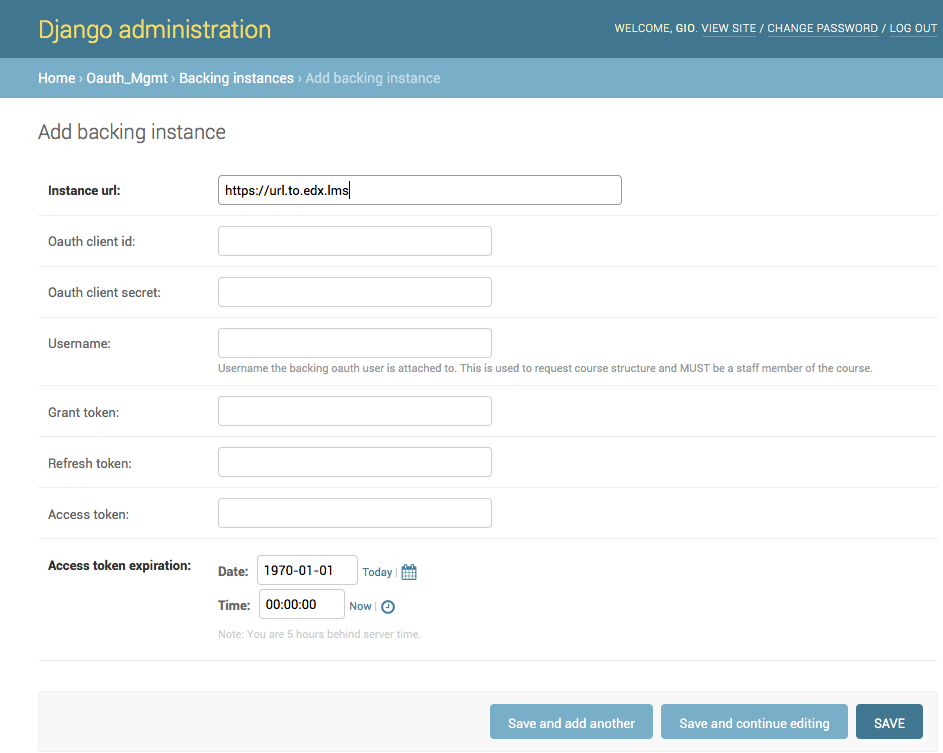
2. in the "Authentication and Authorization" section, create new user (e.g. "edx_user") that will be connected to the OAUTH instance
  - select the "Backing instance" create in A.1. (`https://url.to.edx.lms`) as "Edx instance"
  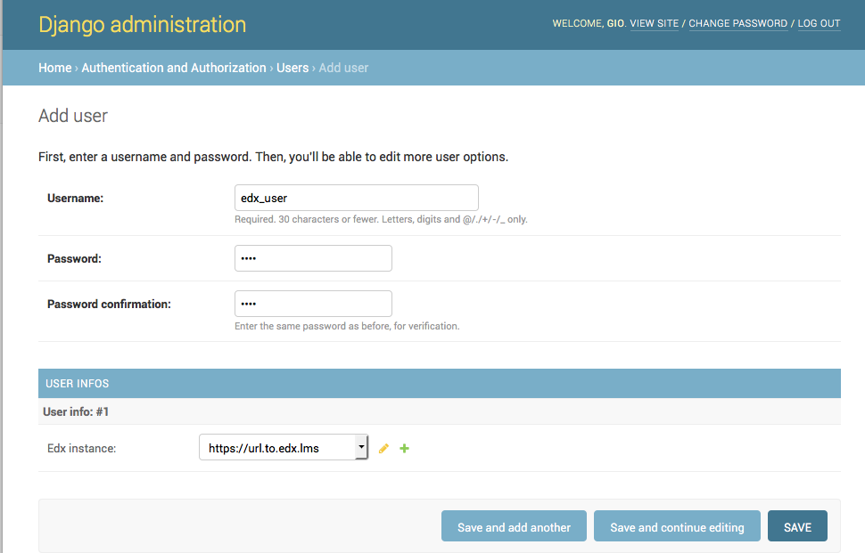
3. in the "Oauth2_Provider" section, create an "Applications" instance
  - User: select the user created in A.2. ("edx_user")
  - Client type: "Confidential"
  - Authorization grant type: "Client credentials"
  - Name: something meaningful, like "`edx instance at https://url.to.edx.lms`"
  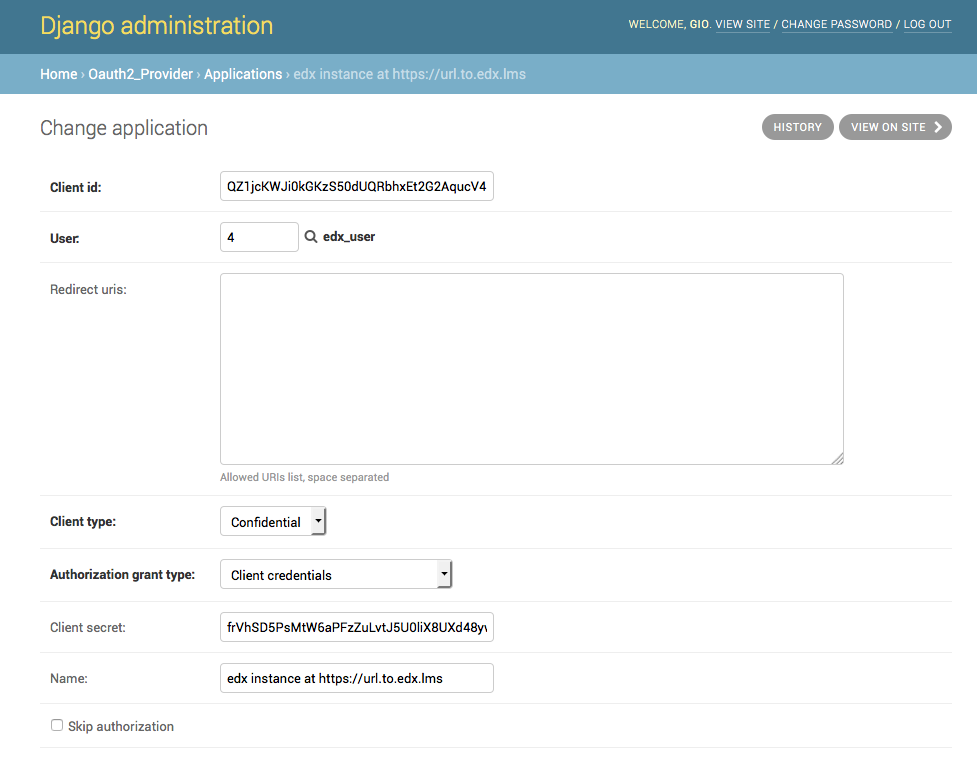

##### B. in EDX admin

1. in the "Ccxcon" section, create a "CCX Connector" instance
  - Url: the URL of the CCXCON instance you want to point EDX to (e.g. `https://url.to.ccxcon`).
  - Oauth client id: the "client id" of the application created in **A.3.**
  - Oauth client secret: the "client secret" of the application created in **A.3.**
  - Title: something meaningful like "`CCXCON at https://url.to.ccxcon`"
  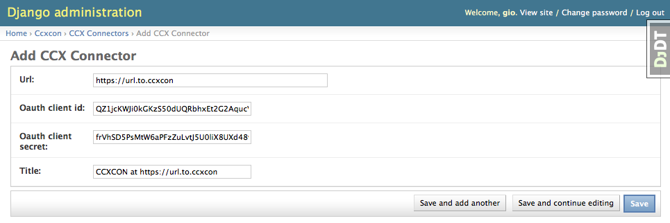
2. in the "Authentication and Authorization" section, create a new user (e.g. "ccxcon_user") that will be connected to the OAUTH instance
  - first create the user
  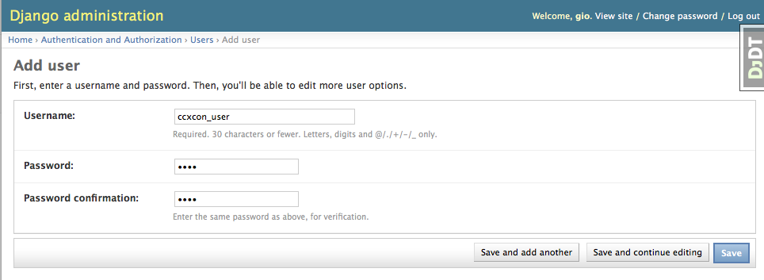
  - make sure the user is active
  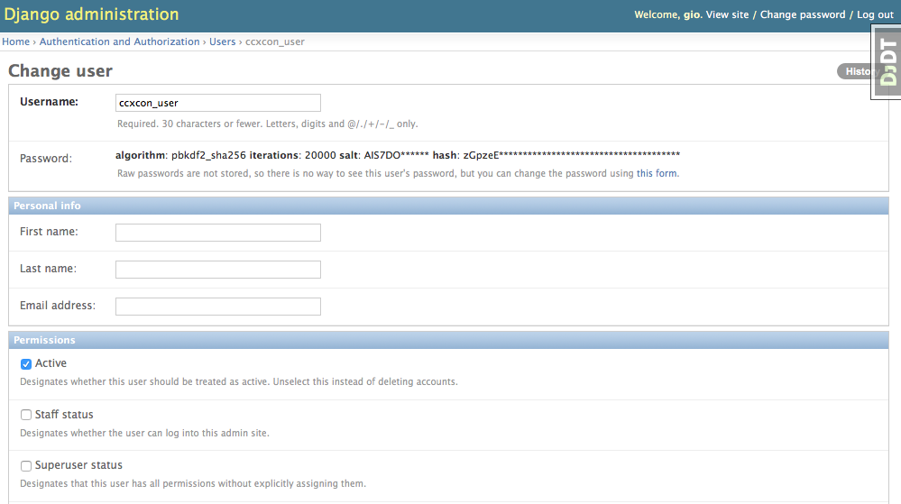
3. in the "Oauth2" section, create a new "Client" instance.
  - User: select the user created in **B.2.** ("ccxcon_user")
  - Name: something meaningful, like "`CCXCON at https://url.to.ccxcon`"
  - Url: the URL of the CCXCON instance (e.g. `https://url.to.ccxcon`)
  - Redirect uri: mandatory but not important (e.g. `http://localhost/CCXCon/`)
  - Client type: "Confidential (Web applications)"
  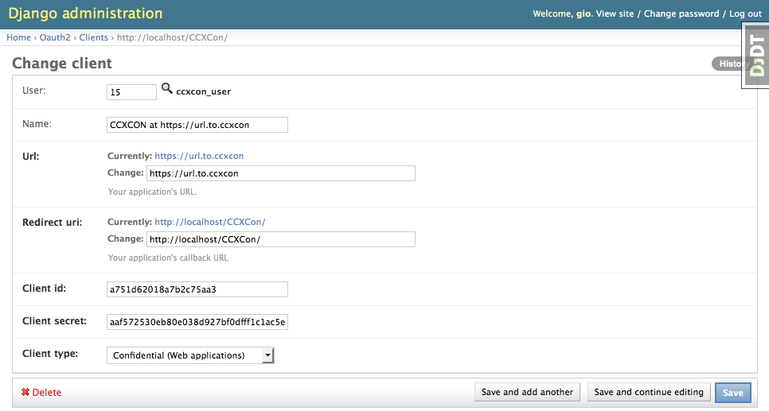
4. in the "Oauth2" section, create a new "Grant" instance.
  - User: select the user created in **B.2.** ("ccxcon_user")
  - Client: selelect the client created in **B.3.** (`http://localhost/CCXCon/`, yes, for some reason it is identified by the redirect URL)
  - Expires: any date in the future
  - Redirect uri: not important (e.g. `http://localhost/CCXCon/`)
  - Scope: the default `0` is fine
  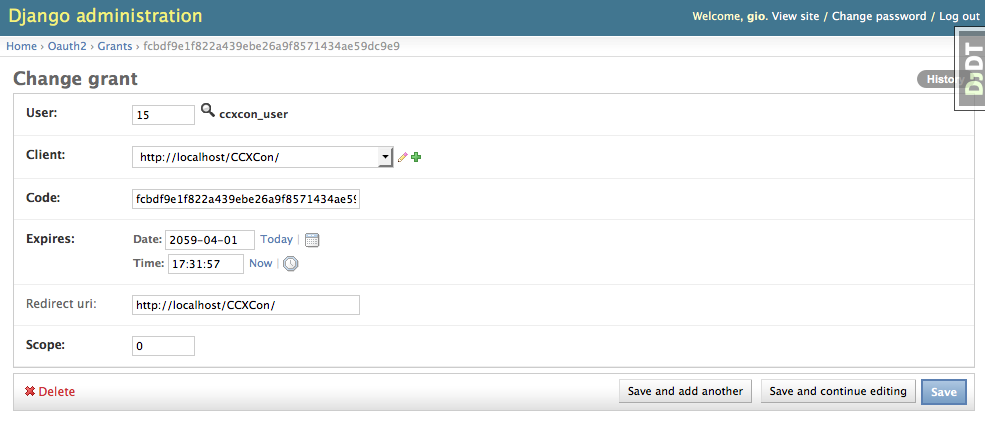

##### C. in CCXCON admin
1. in the "Oauth_Mgmt" section, "Backing instances", open the instance created in **A.1.** and add the following additional info
  - Oauth client id: the "client id" created in **B.3.**
  - Oauth client secret: the "client secret" created in **B.3.**
  - Username: the username string of the user created in **B.2.** ("ccxcon_user")
  - Grant token: the "code" created in **B.4.**
  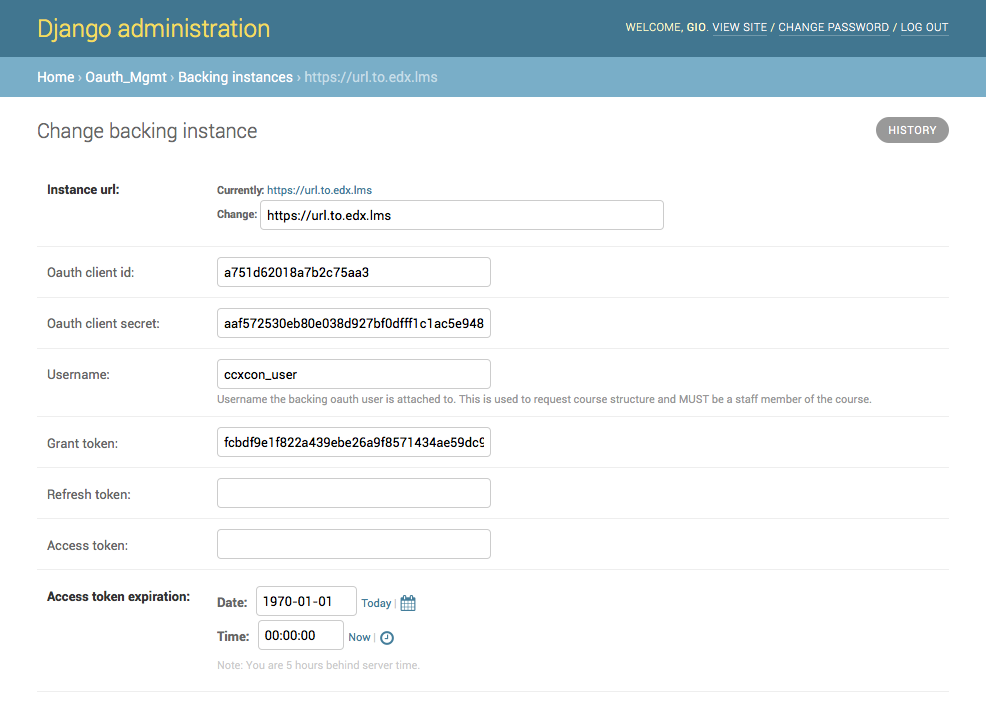

### Course configuration

##### D. in EDX LMS
1. from the dashboard open the course you want to push to CCXCON
2. open the "Instructor" tab (if you do not see this tab it means you need to be added as instructor to this course by an existing instructor"
3. open the "Membership" sub-tab
4. in the "Course Team Management" section, from "Select a course team role" choose `staff`
  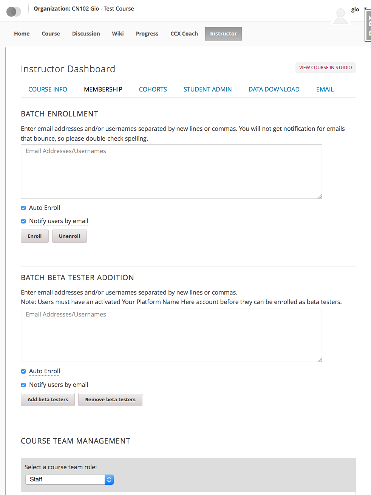
5. add the user created in **B.2.** as staff of the course
  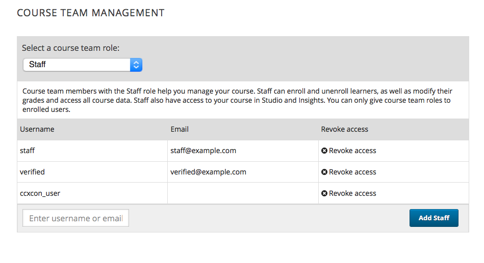

##### E. in EDX Studio
1. open the advanced settings of the course you chose in **D.1.**
  - set the "CCX Connector URL" to **the exact same URL string** put in the "CCX Connector" instance created in **B.1.**: NOTE: trailing slashes matter.
  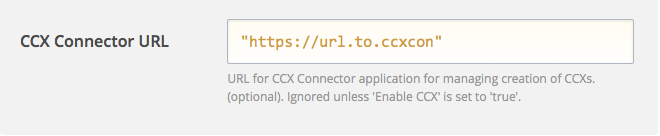
  - set the "Enable CCX" to `true`
  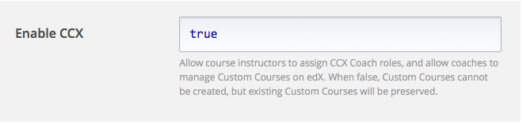
